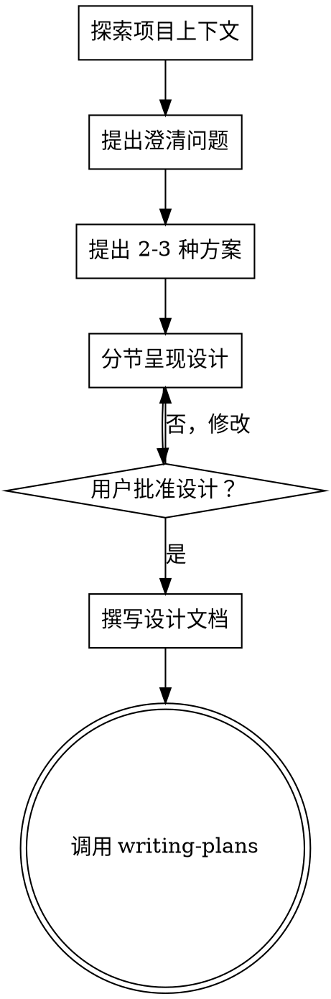

# 头脑风暴：从想法到设计

## 概述

通过自然的协作对话，帮助将想法转化为完整的设计和规格说明。

首先了解当前项目上下文，然后逐个提问以细化想法。一旦理解了要构建什么，呈现设计方案并获得用户批准。

<HARD-GATE>
在呈现设计并获得用户批准之前，不得调用任何实现技能、编写任何代码、搭建任何项目或采取任何实现行动。这适用于每个项目，无论看起来多简单。
</HARD-GATE>

## 反模式："这太简单了，不需要设计"

每个项目都要经过此流程。待办清单、单一功能工具、配置更改——全部如此。"简单"项目正是未检验假设造成最多浪费的地方。设计可以很短（真正简单的项目只需几句话），但你**必须**呈现并获得批准。

## 检查清单

你必须为以下每一项创建任务，并按顺序完成：

1. **探索项目上下文** — 检查文件、文档、最近提交
2. **提出澄清问题** — 逐个提问，理解目的/约束/成功标准
3. **提出 2-3 种方案** — 附带权衡分析和你的推荐
4. **呈现设计** — 按复杂度分节呈现，每节后获得用户确认
5. **撰写设计文档** — 保存到 `docs/plans/YYYY-MM-DD-<主题>-design.md` 并 commit
6. **过渡到实现** — 调用 writing-plans 技能创建实现计划

## 流程

**终态是调用 writing-plans。** 不要调用 frontend-design、mcp-builder 或任何其他实现技能。头脑风暴之后唯一调用的技能是 writing-plans。

## 流程详解

**理解想法：**
- 先查看当前项目状态（文件、文档、最近提交）
- 逐个提问以细化想法
- 尽可能使用多选题，开放式问题也可以
- 每条消息只问一个问题 — 如果某个话题需要更多探索，拆分为多个问题
- 聚焦于理解：目的、约束、成功标准

**探索方案：**
- 提出 2-3 种不同方案并附带权衡分析
- 以对话方式呈现选项，附上你的推荐和理由
- 优先展示你推荐的选项并解释原因

**呈现设计：**
- 一旦你确信理解了要构建什么，呈现设计
- 每节按复杂度调整篇幅：简单的几句话，复杂的最多 200-300 字
- 每节后询问到目前为止是否正确
- 覆盖：架构、组件、数据流、错误处理、测试
- 准备好回溯澄清不清楚的地方

## 设计完成后

**文档化：**
- 将验证通过的设计写入 `docs/plans/YYYY-MM-DD-<主题>-design.md`
- 如有可用，使用 elements-of-style:writing-clearly-and-concisely 技能
- 将设计文档 commit 到 git

**实现：**
- 调用 writing-plans 技能创建详细实现计划
- 不要调用其他技能。writing-plans 是下一步。

## 核心原则

- **一次一个问题** — 不要用多个问题让人应接不暇
- **优先多选题** — 比开放式问题更容易回答
- **无情 YAGNI** — 从所有设计中移除不必要的功能
- **探索替代方案** — 始终在确定前提出 2-3 种方案
- **增量验证** — 呈现设计，获得批准后再推进
- **保持灵活** — 不清楚时回溯澄清
