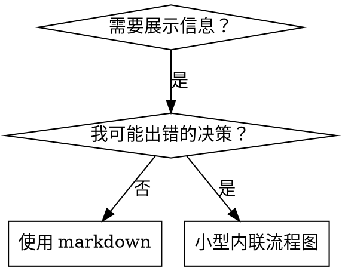

# Writing Skills

## 概述

**编写技能就是将 TDD 应用于流程文档。**

**个人技能存放在 agent 专用目录（Claude Code 用 `~/.claude/skills`，Codex 用 `~/.agents/skills/`）**

你编写测试用例（用子代理的压力场景），观察它们失败（基线行为），编写技能（文档），观察测试通过（agent 遵守），然后重构（堵住漏洞）。

**核心原则：** 如果没有观察过 agent 在没有技能时失败，你不知道技能是否教会了正确的东西。

**必需背景：** 使用本技能前必须理解 superpowers:test-driven-development。该技能定义了基本的 RED-GREEN-REFACTOR 循环。本技能将 TDD 适配到文档编写。

**官方指南：** Anthropic 的官方技能编写最佳实践参见 anthropic-best-practices.md。

## 什么是技能？

**技能**是经过验证的技术、模式或工具的参考指南。帮助未来的 Claude 实例找到并应用有效方法。

**技能是：** 可复用的技术、模式、工具、参考指南

**技能不是：** 关于你如何一次解决问题的叙事

## 技能的 TDD 映射

| TDD 概念 | 技能创建 |
|----------|----------|
| **测试用例** | 用子代理的压力场景 |
| **生产代码** | 技能文档 (SKILL.md) |
| **测试失败 (RED)** | agent 在没有技能时违反规则（基线） |
| **测试通过 (GREEN)** | agent 在有技能时遵守规则 |
| **重构** | 在保持合规的同时堵住漏洞 |
| **先写测试** | 编写技能前先运行基线场景 |
| **观察失败** | 记录 agent 使用的确切合理化借口 |
| **最小代码** | 编写针对具体违规的技能 |
| **观察通过** | 验证 agent 现在合规 |
| **重构循环** | 发现新合理化借口 → 堵住 → 重新验证 |

## 何时创建技能

**创建条件：**
- 技术对你来说不够直观
- 你会在多个项目中再次参考
- 模式适用广泛（非项目特定）
- 他人也能受益

**不创建条件：**
- 一次性解决方案
- 其他地方已有充分文档的标准实践
- 项目特定约定（放 CLAUDE.md）
- 可机械约束的（能用 regex/验证自动化的，自动化它 — 文档留给判断型决策）

## 技能类型

### 技术型
有步骤的具体方法（条件等待、根因追踪）

### 模式型
思考问题的方式（扁平化标记、测试不变量）

### 参考型
API 文档、语法指南、工具文档（Office 文档）

## 目录结构

```
skills/
  skill-name/
    SKILL.md              # 主参考（必需）
    supporting-file.*     # 仅在需要时
```

**扁平命名空间** — 所有技能在同一个可搜索命名空间中

**拆分为单独文件的：**
1. **重度参考**（100+ 行）— API 文档、综合语法
2. **可复用工具** — 脚本、工具、模板

**保持内联的：**
- 原则和概念
- 代码模式（< 50 行）
- 其他一切

## SKILL.md 结构

**Frontmatter (YAML)：**
- 仅支持两个字段：`name` 和 `description`
- 总计最多 1024 字符
- `name`：仅用字母、数字和连字符（无括号、特殊字符）
- `description`：第三人称，仅描述何时使用（不描述做什么）
  - 以 "Use when..." 开头聚焦触发条件
  - 包含具体症状、场景和上下文
  - **绝不总结技能的流程或工作流**（见 CSO 部分）
  - 尽量控制在 500 字符以内

```markdown
---
name: Skill-Name-With-Hyphens
description: Use when [具体触发条件和症状]
---

# Skill Name

## 概述
这是什么？1-2 句核心原则。

## 何时使用
[若决策不明显，使用小型内联流程图]

症状和使用场景的要点列表
何时不使用

## 核心模式（技术型/模式型）
前后代码对比

## 快速参考
常见操作的表格或要点

## 实现
简单模式内联代码
重度参考或可复用工具链接到单独文件

## 常见错误
出什么问题 + 修复方法

## 实际效果（可选）
具体结果
```

## Claude 搜索优化 (CSO)

**对发现至关重要：** 未来的 Claude 需要能**找到**你的技能

### 1. 丰富的 description 字段

**目的：** Claude 读取 description 来决定为给定任务加载哪些技能。让它回答："我现在应该读这个技能吗？"

**格式：** 以 "Use when..." 开头聚焦触发条件

**关键：description = 何时使用，不是技能做什么**

description 应仅描述触发条件。不要在 description 中总结技能的流程或工作流。

**为什么重要：** 测试发现，当 description 总结了技能工作流时，Claude 可能会遵循 description 而不是读取完整技能内容。

```yaml
# ❌ 差：总结了工作流 — Claude 可能遵循这个而不读技能
description: Use when executing plans - dispatches subagent per task with code review between tasks

# ✅ 好：仅触发条件，无工作流总结
description: Use when executing implementation plans with independent tasks in the current session
```

### 2. 关键词覆盖

使用 Claude 会搜索的词：
- 错误信息："Hook timed out"、"ENOTEMPTY"、"race condition"
- 症状："flaky"、"hanging"、"zombie"、"pollution"
- 同义词："timeout/hang/freeze"、"cleanup/teardown/afterEach"
- 工具：实际命令、库名、文件类型

### 3. 描述性命名

**使用主动语态、动词优先：**
- ✅ `creating-skills` 而非 `skill-creation`
- ✅ `condition-based-waiting` 而非 `async-test-helpers`

### 4. Token 效率（关键）

**问题：** getting-started 和常用技能加载到每次对话中。每个 token 都有价值。

**目标字数：**
- getting-started 工作流：每个 <150 词
- 常加载技能：总计 <200 词
- 其他技能：<500 词（仍然要简洁）

**技巧：**

将详情移到工具帮助中：
```bash
# ❌ 差：在 SKILL.md 中记录所有标志
search-conversations supports --text, --both, --after DATE, --before DATE, --limit N

# ✅ 好：引用 --help
search-conversations supports multiple modes and filters. Run --help for details.
```

使用交叉引用：
```markdown
# ❌ 差：重复工作流细节
When searching, dispatch subagent with template...
[20 lines of repeated instructions]

# ✅ 好：引用其他技能
Always use subagents (50-100x context savings). REQUIRED: Use [other-skill-name] for workflow.
```

压缩示例：
```markdown
# ❌ 差：冗长示例（42 词）
your human partner: "How did we handle authentication errors in React Router before?"
You: I'll search past conversations for React Router authentication patterns.
[Dispatch subagent with search query: "React Router authentication error handling 401"]

# ✅ 好：最小示例（20 词）
Partner: "How did we handle auth errors in React Router?"
You: Searching...
[Dispatch subagent → synthesis]
```

### 5. 交叉引用其他技能

使用技能名，附带明确的需求标记：
- ✅ 好：`**REQUIRED SUB-SKILL:** Use superpowers:test-driven-development`
- ✅ 好：`**REQUIRED BACKGROUND:** You MUST understand superpowers:systematic-debugging`
- ❌ 差：`See skills/testing/test-driven-development`（不清楚是否必需）
- ❌ 差：`@skills/testing/test-driven-development/SKILL.md`（强制加载，消耗上下文）

**为什么不用 @ 链接：** `@` 语法会立即强制加载文件，在你需要之前就消耗 200k+ 上下文。

## 流程图使用



**仅在以下情况使用流程图：**
- 非显而易见的决策点
- 可能过早停止的流程循环
- "何时用 A vs B" 的决策

**永远不要用流程图：**
- 参考材料 → 表格、列表
- 代码示例 → Markdown 代码块
- 线性指令 → 编号列表
- 无语义含义的标签（step1、helper2）

## 代码示例

**一个优秀的示例胜过许多平庸的示例**

选择最相关的语言：
- 测试技术 → TypeScript/JavaScript
- 系统调试 → Shell/Python
- 数据处理 → Python

**好的示例：**
- 完整且可运行
- 注释良好，解释原因
- 来自真实场景
- 清晰展示模式
- 可直接适配（非通用模板）

## 铁律（与 TDD 相同）

```
没有失败测试，不写技能
```

这适用于新技能和现有技能的编辑。

先写技能再测试？删掉，重来。
没有测试就编辑？同样违规。

**无例外：**
- 不因"简单添加"而跳过
- 不因"只是加一节"而跳过
- 不因"文档更新"而跳过
- 不把未测试的改动当"参考"保留
- 不在测试运行时"顺便修改"
- 删除就是删除

## 测试所有技能类型

### 纪律执行型技能（规则/要求）

**测试方法：**
- 学术问题：它们理解规则吗？
- 压力场景：它们在压力下遵守吗？
- 多重压力组合：时间 + 沉没成本 + 疲惫
- 识别合理化借口并添加明确反驳

**成功标准：** Agent 在最大压力下遵守规则

### 技术型技能（操作指南）

**测试方法：**
- 应用场景：能正确应用技术吗？
- 变体场景：能处理边缘情况吗？
- 信息缺失测试：指令有漏洞吗？

**成功标准：** Agent 成功将技术应用到新场景

### 模式型技能（心智模型）

**测试方法：**
- 识别场景：能识别模式何时适用吗？
- 应用场景：能使用心智模型吗？
- 反例：知道何时不应用吗？

**成功标准：** Agent 正确识别何时/如何应用模式

### 参考型技能（文档/API）

**测试方法：**
- 检索场景：能找到正确信息吗？
- 应用场景：能正确使用找到的信息吗？
- 缺口测试：常见用例都覆盖了吗？

**成功标准：** Agent 找到并正确应用参考信息

## 跳过测试的常见借口

| 借口 | 现实 |
|------|------|
| "技能很明显" | 对你明显 ≠ 对其他 agent 明显。测试它。 |
| "只是个参考" | 参考也有漏洞、不清晰的部分。测试检索。 |
| "测试过度了" | 未测试的技能总有问题。15 分钟测试省几小时。 |
| "有问题再测" | 问题 = agent 用不了技能。部署前测试。 |
| "太繁琐" | 测试比调试生产中的坏技能不繁琐。 |
| "我有信心" | 过度自信保证有问题。无论如何测试。 |
| "学术审查够了" | 阅读 ≠ 使用。测试应用场景。 |
| "没时间" | 部署未测试技能浪费更多时间修。 |

**以上全部意味着：部署前测试。无例外。**

## 防合理化漏洞

执行纪律的技能（如 TDD）需要抵抗合理化。Agent 很聪明，在压力下会找漏洞。

### 明确堵住每个漏洞

不要只陈述规则 — 禁止具体变通方法：

```markdown
先写代码后写测试？删掉。重来。

**无例外：**
- 不要保留为"参考"
- 不要在写测试时"顺便修改"
- 不要看它
- 删除就是删除
```

### 应对"精神 vs 字面"论点

早期添加基础原则：

```markdown
**违反规则的字面就是违反规则的精神。**
```

### 构建合理化反驳表

从基线测试中捕获合理化借口：

```markdown
| 借口 | 现实 |
|------|------|
| "太简单不用测" | 简单代码也会出错。测试只需 30 秒。 |
| "我之后再测" | 测试立即通过证明不了什么。 |
| "后测达到相同目的" | 后测 = "这做了什么？" 先测 = "这应该做什么？" |
```

### 创建红旗清单

让 agent 容易自检：

```markdown
## 红旗 — 停下来重来

- 测试前写代码
- "我已经手动测过了"
- "后测达到相同目的"
- "这是精神不是仪式"
- "这次不一样因为..."

**以上全部意味着：删代码。从 TDD 重来。**
```

## 技能的 RED-GREEN-REFACTOR

遵循 TDD 循环：

### RED：写失败测试（基线）

在没有技能的情况下用子代理运行压力场景。记录确切行为：
- 它们做了什么选择？
- 使用了什么合理化借口（原文）？
- 哪些压力触发了违规？

这就是"观察测试失败" — 你必须在编写技能前看到 agent 的自然行为。

### GREEN：写最小技能

编写针对那些具体合理化借口的技能。不要为假设情况添加额外内容。

在有技能的情况下运行相同场景。Agent 现在应该合规。

### REFACTOR：堵住漏洞

Agent 找到新的合理化借口？添加明确反驳。重新测试直到无懈可击。

## 反模式

### ❌ 叙事型示例
"在 2025-10-03 的会话中，我们发现空 projectDir 导致了..."
**为什么差：** 太具体，不可复用

### ❌ 多语言稀释
example-js.js, example-py.py, example-go.go
**为什么差：** 质量平庸，维护负担

### ❌ 流程图中的代码
**为什么差：** 无法复制粘贴，难以阅读

### ❌ 通用标签
helper1, helper2, step3, pattern4
**为什么差：** 标签应有语义含义

## 停：在进入下一个技能之前

**编写任何技能后，你必须停下来完成部署流程。**

**不要：**
- 批量创建多个技能而不逐个测试
- 在当前技能验证前进入下一个
- 因为"批处理更高效"而跳过测试

## 技能创建检查清单（TDD 适配版）

**RED 阶段 — 写失败测试：**
- [ ] 创建压力场景（纪律型技能需 3+ 组合压力）
- [ ] 在没有技能的情况下运行场景 — 逐字记录基线行为
- [ ] 识别合理化借口/失败中的模式

**GREEN 阶段 — 写最小技能：**
- [ ] name 仅使用字母、数字、连字符
- [ ] YAML frontmatter 仅含 name 和 description（最多 1024 字符）
- [ ] description 以 "Use when..." 开头并包含具体触发条件/症状
- [ ] description 用第三人称
- [ ] 全文包含搜索关键词（错误、症状、工具）
- [ ] 清晰的概述和核心原则
- [ ] 针对基线中识别的具体失败
- [ ] 代码内联或链接到单独文件
- [ ] 一个优秀示例（非多语言）
- [ ] 在有技能的情况下运行场景 — 验证 agent 现在合规

**REFACTOR 阶段 — 堵住漏洞：**
- [ ] 识别测试中的新合理化借口
- [ ] 添加明确反驳（如果是纪律型技能）
- [ ] 从所有测试迭代构建合理化反驳表
- [ ] 创建红旗清单
- [ ] 重新测试直到无懈可击

**质量检查：**
- [ ] 仅在决策不明显时使用小流程图
- [ ] 快速参考表
- [ ] 常见错误部分
- [ ] 无叙事性故事
- [ ] 仅工具或重度参考使用支持文件

**部署：**
- [ ] 将技能 commit 到 git 并 push（如已配置 fork）
- [ ] 考虑通过 PR 贡献回来（如广泛有用）

## 发现工作流

未来 Claude 如何找到你的技能：

1. **遇到问题**（"测试不稳定"）
2. **找到技能**（description 匹配）
3. **扫描概述**（这相关吗？）
4. **阅读模式**（快速参考表）
5. **加载示例**（仅在实现时）

**为这个流程优化** — 把可搜索的词尽早、尽量多地放进去。

## 总结

**编写技能就是流程文档的 TDD。**

同样的铁律：没有失败测试，不写技能。
同样的循环：RED（基线）→ GREEN（写技能）→ REFACTOR（堵漏洞）。
同样的好处：更好的质量、更少的意外、无懈可击的结果。
